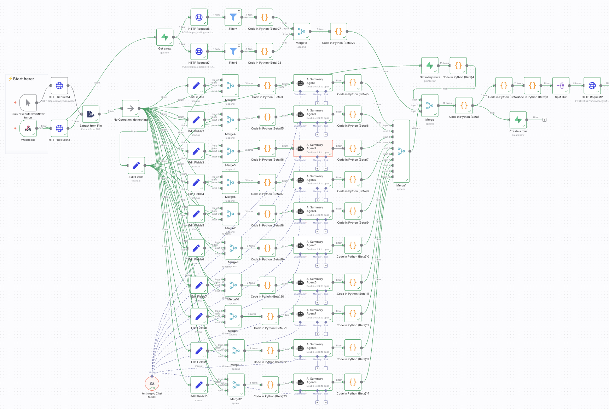

## Story 

## Demo

 video

## Assessment Criteria

## Architecture

### Web interface - Lovable

### Workflow Management - n8n

### Backend - Supabase

### Additional Logic - Claude API

### interview - elevenlabs

### video avatar - beyondpresence

##

