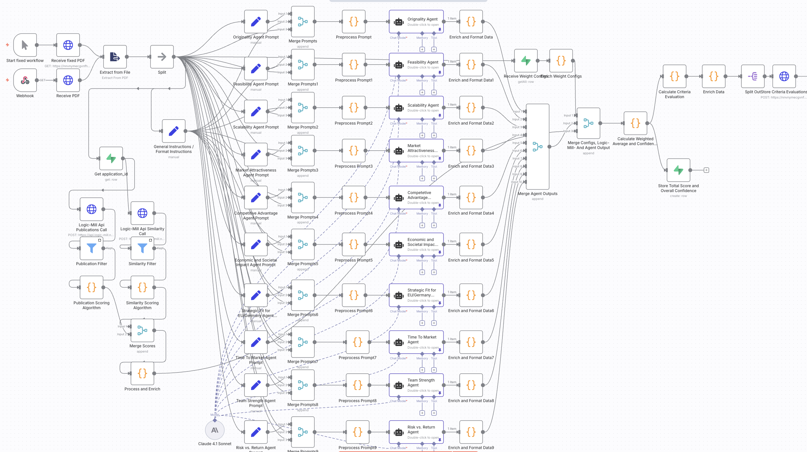
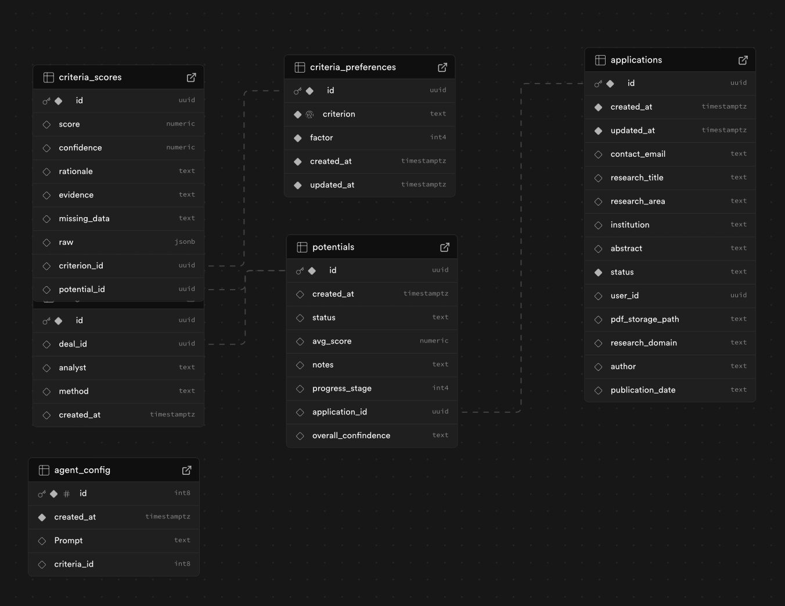

## Story 

### 🚀 Analysa — An AI-Powered Research Innovation Assessment Platform
Analysa is an AI-driven platform designed to evaluate the breakthrough potential of research ideas and scientific papers. It enables research institutions, innovation analysts, and funding organizations to identify high-impact, high-novelty innovations faster and more accurately.

### How It Works
1. Upload Research — Add a research paper, abstract, or proposal
2. Analysa performs an automated assessment of breakthrough innovation potential by evaluating key criteria such as empirical novelty analysis (based on patents and publications), feasibility, scalability, and many more dimensions as described below.

3. Receive a detailed report with scores, recommendations, and potential classification

### Why Analysa?
By combining AI and semantic similarity search across the Max Planck research database, Analysa helps:
- Discover breakthrough research with startup potential
- Support evidence-based funding decisions
- Accelerate the journey from research to innovation

## Assessment Criteria

The final Breakthrough Potential Score is calculated by weighting the following criteria, each rated on a scale from 1 to 5 (1 = strongest, 5 = weakest) (A detailed description of each scoring criterion is provided in the supplement below.)

1. Novelty (empirical assessment using the Max Planck database)
2. Feasability
3. Scalability
4. Market Attractiveness
5. Competetive Advantage
6. Economic and Societal Impact
7. Strategic Fit for EU/Germany 
8. Time to Market
9. Team Strength
10. Risk vs. Return

> **Note:** Users can customize the weighting of each criterion to align with their specific goals or preferences

#### Max Planck Research Database - Logic Mill API
For the novelty assessment (criteria 1), Analysa accesses the Max Planck research database through the Logic Mill API to measure the semantic similarity between a submitted research abstract and the global body of patents and publications. Based on these similarity results, we count the number of documents—both patents and publications—that exceed a defined similarity threshold. To reflect real-world innovation dynamics, we weight patent counts more heavily than publication counts (4:1), since the existence of similar patents often indicates reduced economic potential for startups emerging from the research idea. A high score indicates few close matches (high novelty), while a low score reflects strong overlap with existing work.

#### Claude-based AI agents

The evaluation of criteria 2–10 is performed by an advanced Claude-based AI agents, leveraging contextual reasoning and domain-specific knowledge to ensure accurate and consistent assessments.

## Demo

 video
 
## Tech Stack

- ### Workflow Management - n8n
  

- ### Web interface - Lovable
    link to website
  see video presentation and code

- ### Backend - Supabase
    
    
- ### Additional Logic - Claude API
  
  
- ### Assistant (Chat with Analysa) - beyondpresence
  
  

## Supplement - Assessment Criteria

### Research Evaluation Criteria (1–5, strongest = 1, weakest = 5)

1. **Novelty**
   - 1 = This idea appears highly novel, with no or almost no closely related patents or publications found.
   - 2 = This idea shows limited overlap with existing work, suggesting it introduces concepts not widely explored.” 
   - 3 = This idea has some similarities to existing research or patents, but still shows a degree of originality.
   - 4 = This idea overlaps strongly with established work, indicating it is less original and likely builds on existing concepts.  
   - 5 = This idea is highly similar to many existing patents or publications, suggesting it is not novel.

2. **Technical Feasibility**
   - 1 = Strong experimental evidence, near prototype-ready.  
   - 2 = Clear technical path, most hurdles addressed.  
   - 3 = Feasible but key unknowns remain.  
   - 4 = Mostly speculative.  
   - 5 = Highly speculative, no path to feasibility.  

3. **Scalability**
   - 1 = Globally scalable across industries.  
   - 2 = Large sector/region adoption possible.  
   - 3 = Limited to a few industries.  
   - 4 = Small/niche use.  
   - 5 = Very narrow, not scalable.  

4. **Market Attractiveness & Timing**
   - 1 = Clear demand + strong timing.  
   - 2 = Demand visible, timing good.  
   - 3 = Potential demand but uncertain timing.  
   - 4 = Weak/unclear demand.  
   - 5 = No visible market.  

5. **Competitive Advantage**
   - 1 = Unique IP/know-how, hard to replicate.  
   - 2 = Strong protection/barriers.  
   - 3 = Some edge but replicable.  
   - 4 = Weak differentiation.  
   - 5 = No visible advantage.  

6. **Economic & Societal Impact**
   - 1 = Transformative global benefits.  
   - 2 = Major benefits in big industries.  
   - 3 = Moderate benefits.  
   - 4 = Small/local impact.  
   - 5 = Minimal impact.  

7. **Application & Commercialization Pathway**
   - 1 = Clear product/application + obvious payor/adopter.  
   - 2 = Good application idea, likely payors identified.  
   - 3 = Some potential applications, but value capture unclear.  
   - 4 = Application highly speculative, no clear adopter.  
   - 5 = No visible path to application or value creation.  

8. **Time to Market**
   - 1 = 3–5 years.  
   - 2 = 5–7 years.  
   - 3 = 7–10 years.  
   - 4 = 10–15 years.  
   - 5 = 15+ years.  

9. **Team Strength**
   - 1 = World-class, entrepreneurial, proven track record.  
   - 2 = Strong, with translational experience.  
   - 3 = Good but lacks commercial/venture experience.  
   - 4 = Weak execution capacity.  
   - 5 = No credible team evidence.  

10. **Risk vs. Return**
    - 1 = High risk, transformative upside.  
    - 2 = Medium–high risk, strong upside.  
    - 3 = Balanced but modest upside.  
    - 4 = Low risk, low upside.  
    - 5 = Poor balance.  

11. **Strategic Fit (EU/Germany)**
    - 1 = Critical for EU sovereignty/competitiveness.  
    - 2 = Major relevance.  
    - 3 = Some relevance.  
    - 4 = Minor.  
    - 5 = No relevance.  
