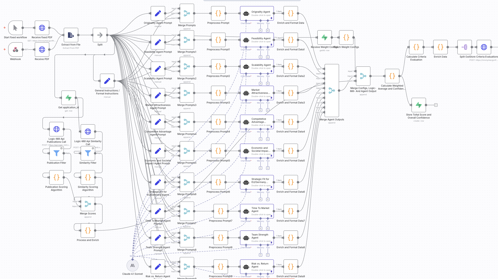

## Story 

### 🚀 Analysa — An AI-Powered Research Innovation Assessment Platform
Analysa is an AI-driven platform designed to evaluate the breakthrough potential of research ideas and scientific papers. It enables research institutions, innovation analysts, and funding organizations to identify high-impact, high-novelty innovations faster and more accurately.

### How It Works
1. Upload Research — Add a research paper, abstract, or proposal
2. Analysa performs an automated assessment of breakthrough innovation potential by evaluating key criteria such as empirical novelty analysis (based on patents and publications), feasibility, scalability, and many more dimensions as described below.
Get Insights
3. Receive a detailed report with scores, recommendations, and potential classification

## Demo

 video

## Assessment Criteria

The final Breakthrough Potential Score is calculated by weighting the following criteria, each rated on a scale from 1 to 5 (1 = strongest, 5 = weakest)

1. Novelty (empirical assessment using the Max Planck database)
2. Feasability
3. Scalability
4. Market Attractiveness
5. Competetive Advantage
6. Economic and Societal Impact
7. Strategic Fit for EU/Germany 
8. Time to Market
9. Team Strength
10. Risk vs. Return

Criteria 1, the novelty assessment is based on an empirical evauluation by accessing the Max Planck research database through the Logic Mill API. We measure the semantic similarity between a new idea and the global body of patents and research. A good score indicates few close matches (high novelty), while a low score reflects strong overlap with existing work.

The assessment of the criteria 2 - 10 is done by a claude agents.

## Architecture

- ### Web interface - Lovable
  short description

- ### Workflow Management - n8n
  short description
- ### Backend - Supabase
  short description
- ### Additional Logic - Claude API
  short description
- ### interview - elevenlabs
  short description
- ### video avatar - beyondpresence
  short description

##

