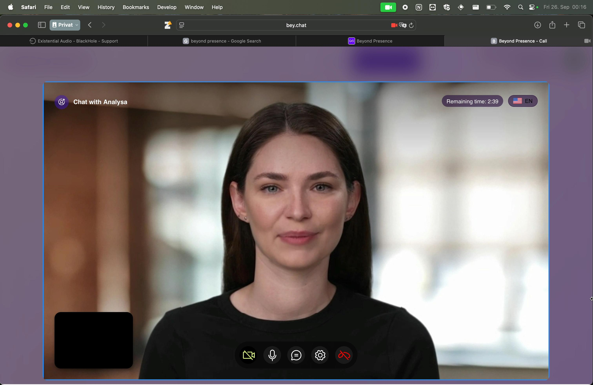

## Story 

### 🚀 Analysa — An AI-Powered Research Innovation Assessment Platform
Analysa is an AI-driven platform designed to evaluate the breakthrough potential of research ideas and scientific papers. It enables research institutions, innovation analysts, and funding organizations to identify high-impact, high-novelty innovations faster and more accurately.

### How It Works
1. Upload Research — Add a research paper, abstract, or proposal
2. Analysa performs an automated assessment of breakthrough innovation potential by evaluating key criteria such as empirical novelty analysis (based on patents and publications), feasibility, scalability, and many more dimensions as described below.

3. Receive a detailed report with scores, recommendations, and potential classification

### Why Analysa?
By combining AI and semantic similarity search across the Max Planck research database, Analysa helps:
- Discover breakthrough research with startup potential
- Support evidence-based funding decisions
- Accelerate the journey from research to innovation

## Assessment Criteria

The final Breakthrough Potential Score is calculated by weighting the following criteria, each rated on a scale from 1 to 5 (1 = strongest, 5 = weakest)

1. Novelty (empirical assessment using the Max Planck database)
2. Feasability
3. Scalability
4. Market Attractiveness
5. Competetive Advantage
6. Economic and Societal Impact
7. Strategic Fit for EU/Germany 
8. Time to Market
9. Team Strength
10. Risk vs. Return

#### Max Planck Research Database - Logic Mill API
For the novelty assessment (criteria 1), Analysa accesses the Max Planck research database through the Logic Mill API to measure the semantic similarity between a submitted research abstract and the global body of patents and publications. Based on these similarity results, we count the number of documents—both patents and publications—that exceed a defined similarity threshold. To reflect real-world innovation dynamics, we weight patent counts more heavily than publication counts (4:1), since the existence of similar patents often indicates reduced economic potential for startups emerging from the research idea. A high score indicates few close matches (high novelty), while a low score reflects strong overlap with existing work.

#### Claude-based AI agents

The evaluation of criteria 2–10 is performed by an advanced Claude-based AI agents, leveraging contextual reasoning and domain-specific knowledge to ensure accurate and consistent assessments.

## Demo

 video
 
## Tech Stack

- ### Workflow Management - n8n
  

- ### Web interface - Lovable
    link to website
  see video presentation and code

- ### Backend - Supabase
    
    
- ### Additional Logic - Claude API
  
- ### Interview - elevenlabs
  
- ### Assistant (Chat with Analysa) - beyondpresence
  
  

##

